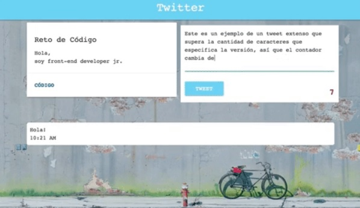
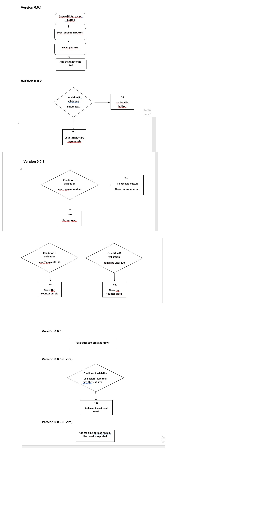

## RETO DE CÓDIGO: TWITTER

## OBJETIVO:
1. Replicar el newsfeed de Twitter.

## PRIMERA PARTE: MAQUETADO Y ESTILO CSS
1. Crea la estructura basica en HTML semantico
2. Crear 2 secciones en HTML principales un nav y un container.
3. Crear el archivo CSS para darle estilos al HTML.
4. Dentro del container se crean3 secciones cada una con los elemntos correspondientes (span,p,button,input,textarea,div).

## SEGUNDA PARTE: CREANDO UN SITIO INTERACTIVO CON JS
1. Crear una función que permita ingresar un texto y un botón para "twittear".
   Agregar un evento de click al botón o de submit al formulario.
   En el evento, obtener el texto.
   Agregar el texto al HTML.

2.Crear una función que no permta ingresar texto vacío (deshabilitar el botón de "twittear").
  Contar la cantidad de caracteres de forma regresiva.

3. Crear una función que cuando pase de los 140 caracteres, deshabilite el botón.
Si pasa los 120 caracteres, mostrar el contador con OTRO color.
Si pasa los 130 caracteres, mostrar el contador con OTRO color.
Si pasa los 140 caracteres, mostrar el contador en negativo.

4. Crear una función que  al presionar enter(/n) que crezca el textarea de acuerdo al tamaño del texto.

5. Crear una función para que cuando la cantidad de caracteres ingresados (sin dar un enter), supera al tamaño del textarea por defecto, debe de agregarse una línea más para que no aparezca el scroll. (Si en caso aplica)

6. Crear una función para que cuando agregar la hora en que se publicó el tweet. En el formato de 24 horas: hh:mm.
